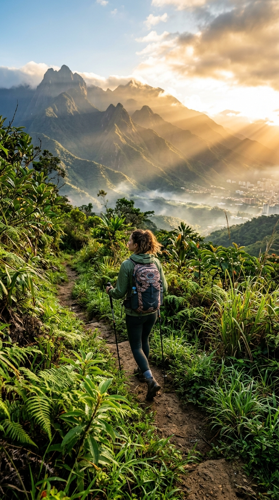

# Waraira • Ávila Pass PWA 🇻🇪

> **Sistema Digital Oficial de Registro de Entrada, Salida y Seguridad en Montaña para el Parque Nacional El Ávila (Waraira Repano) — Caracas, Venezuela.**



---

## 📌 Descripción del Proyecto

**Ávila Pass** es una Progressive Web App (PWA) de alto rendimiento diseñada para excursionistas, senderistas y Guardaparques de **INPARQUES** en el Parque Nacional Waraira Repano. 

La plataforma moderniza el control de acceso a la montaña mediante el escaneo de códigos QR en casetas de guardaparques, ofreciendo trazabilidad en tiempo real, control de descenso antes del anochecer y un protocolo de rescate inmediato con geolocalización GPS en caso de extravío.

---

## 🚀 Características Principales

### 1. Ficha del Excursionista & Contactos de Extravío
- Registro de perfil con foto, nombre completo, documento de identidad (Cédula de Identidad venezolana), tipo de sangre y teléfono móvil (WhatsApp).
- **Asignación obligatoria de contactos de emergencia:** Se notifica a los familiares en caso de no registrar la salida antes de la hora límite permitida (17:30 / 5:30 PM).

### 2. Check-in y Check-out con Códigos QR
- **Escaneo de Entrada:** Al iniciar el ascenso en la caseta de guardaparques (Sabas Nieves, La Julia, Los Venados, etc.), el usuario escanea el código QR oficial del puesto.
- **Ruta y Destino:** Permite indicar el objetivo de la subida (Mirador, El Banquito, No Te Apures, Silla de Caracas, Pico Humboldt, etc.).
- **Escaneo de Salida:** Al regresar del sendero, se escanea el QR de salida para cerrar el registro activo y confirmar que el senderista ha bajado sano y salvo.
- **Simulador Integrado:** Permite probar el flujo de escaneo tanto con cámara en vivo como mediante simulación de casetas oficiales para pruebas de escritorio o laptops.

### 3. Monitoreo en Vivo en Ruta
- Cronómetro en tiempo real de tiempo en montaña.
- Contador regresivo de luz solar restante (aviso preventivo de atardecer a las 18:15 y descenso límite a las 17:30).
- Métricas de altitud (m.s.n.m.) y puesto de entrada registrado.

### 4. Botón de Rescate SOS con GPS
- Generación instantánea de coordenadas de latitud y longitud mediante el sensor GPS del dispositivo.
- Formato estructurado de mensaje SOS con un toque vía WhatsApp dirigido a los contactos de emergencia registrados.
- Acceso directo a números de auxilio de **INPARQUES (0800-ELAVILA / 0800-3528452)** y **Bomberos Forestales (0212-2856410)**.

### 5. Monitor Central de Guardaparques
- Tablero de control para funcionarios de INPARQUES con métricas de senderistas activos en la montaña, descensos completados y alertas de tiempo excedido (> 5 horas en ruta).
- Buscador rápido por Cédula o nombre.

### 6. Carteles QR Oficiales Imprimibles
- Generador de carteles QR oficiales en alta resolución para colocar en los puntos de control físicos del parque nacional.

### 7. PWA 100% Offline & Diseño Responsivo
- Funciona en alta montaña incluso en zonas sin cobertura celular gracias a Service Workers (`sw.js`).
- Instalable como app nativa en dispositivos iOS y Android (manifest.json).
- **Diseño Dual:** Interfaz moderna multipanel para ordenadores/web y navegación optimizada para teléfonos móviles.
- **Iconografía Vectorial:** 100% libre de emojis genéricos; diseño profesional basado en iconos SVG vectoriales y paleta representativa del Ávila (verdes bosque `#0a2e1b`, amarillos sol caraqueño `#f59e0b` y glassmorphism).

---

## 🛠️ Tecnologías Utilizadas

- **Frontend:** HTML5 Semántico, Vanilla CSS Moderno (Design tokens, Grid, Flexbox, Glassmorphism), JavaScript Moderno (ES6+).
- **PWA:** Service Worker con estrategia Network-First, Web App Manifest.
- **Librerías QR (Offline):** `html5-qrcode` (lector por cámara) y `qrcode.js` (generador de códigos oficiales).
- **Backend / Servidor Local:** Node.js HTTP Server (`server.js`) con cabeceras `no-cache` para desarrollo.

---

## 💻 Instalación y Uso Local

### Prerrequisitos
- [Node.js](https://nodejs.org/) instalado en el sistema.
- [Git](https://git-scm.com/) instalado.

### Clonar el repositorio
```bash
git clone https://github.com/lealjesusalberto/Waraira.git
cd Waraira
```

### Ejecutar servidor local
```bash
node server.js
```

Abre tu navegador en:
```
http://localhost:8088/
```

---

## 📂 Estructura del Proyecto

```
Waraira/
├── index.html              # Estructura principal y vistas de la PWA
├── manifest.json           # Configuración PWA para instalación en móviles
├── sw.js                   # Service Worker (gestión de caché offline v4)
├── server.js               # Servidor Node.js ligero para desarrollo local
├── README.md               # Documentación del proyecto
└── assets/
    ├── css/
    │   └── style.css       # Sistema de diseño, tokens, modo web y móvil
    ├── js/
    │   ├── app.js          # Lógica de la app, estado, QR, GPS, SOS
    │   └── vendor/         # Librerías QR offline (html5-qrcode, qrcode.js)
    └── images/             # Fotografías del Ávila, logotipos y assets
```

---

## 📄 Licencia

Este proyecto está bajo la Licencia MIT.
Desarrollado para la protección y disfrute seguro del **Parque Nacional El Ávila (Waraira Repano)**.
